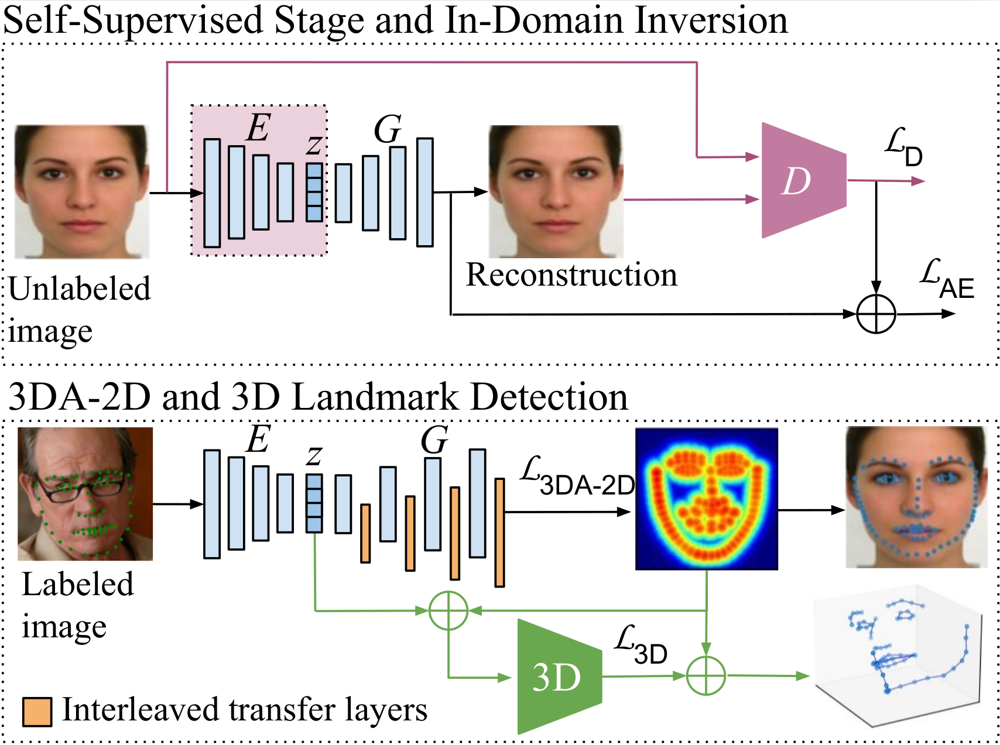

# ParFace-Net

This repository includes the implementation for [**In-Domain Inversion for Improved 3D Face Alignment on Asymmetrical Expressions**](https://www.dfki.de/fileadmin/user_upload/import/14791_FG2024_ParFace.pdf) (FG 2024), for 3D face alignmente on a wide range of facial expressions.



# ParFace

ParFace is publicly available for research purposes. 
To get access to the dataset, please send an email to jilliam_maria.diaz_barros [at] dfki [dot] de.

# Setup and demo

1. Clone repository:

`git clone https://github.com/jilliam/ParFace.git`

2. Install dependencies:

`pip install -r requirements.txt`

3. Download models. More info [here](https://av.dfki.de/publications/in-domain-inversion-for-improved-3d-face-alignment-on-asymmetrical-expressions/).

4. Run demo:

`python demo/demo_3d.py`

# Train your own model

## Prepare datasets and output files

Download the datasets for training your model and update the paths in [local_config.ini](./local_config.ini).
Specify the path to store the models and images during training, in `data` and `outputs`, respectively.

```
DATASET = /path/to/dataset
data = /path/to/models/
outputs = /path/to/output/
```

Process the annotation files to have the same structure as in [process_face_data.py](./src/process_face_data.py).
The annotation files should be placed in [csv/](./csv/).

## Training

### Self-supervised stage

To train the autoencoder for 50 epochs with multiple datasets, using the L2 loss (`--with-l1-loss 0`), WGAN-GP adversarial loss (`--with-wgan-gp 1`) and perceptual loss (`--with-perceptual-loss 1)` with layers (3, 8, 15, 22): 

```
python src/train_aae_unsupervised.py --sessionname self_sup --epoch 50 --with-l1-loss 0 --with-wgan-gp 1 --with-perceptual-loss 1 --p-loss-features 3 8 15 22 --daug 4 --input-size 256 --dataset-train celeba wlp300 menpo2d ls3d neuroface meei palsy affectnet --update-D-freq 1 --normalize
``` 

The model above is trained with input size of 256x256 (`--input-size`), standard data augmentation (`--daug`) and the discriminator is updated every N steps (`--update-D-freq N`).

To fine tune for 50 epochs with the L1 loss instead of L2, use:

```
python src/train_aae_unsupervised.py --sessionname self_sup -r self_sup/00050 -epoch 100 --with-l1-loss 1 --with-wgan-gp 1 --with-perceptual-loss 1 --p-loss-features 3 8 15 22 --daug 4 --input-size 256 ---dataset-train celeba wlp300 menpo2d ls3d neuroface meei palsy affectnet --update-D-freq 1 --normalize
```

### In-domain inversion module

To refine the latent code from the self-supervise stage in 50 epochs, disable the decoder with `--train-decoder 0`:

```
python src/train_aae_unsupervised.py --sessionname self_sup -r self_sup/00100 --epoch 150 --train-decoder 0 --with-l1-loss 0 --with-wgan-gp 1 --with-perceptual-loss 1 --p-loss-features 3 8 15 22 --daug 4 --input-size 256  --dataset-train celeba wlp300 menpo2d ls3d neuroface meei palsy affectnet --update-D-freq 1 --normalize
``` 

### 2D, 3DA-2D and 3D landmark detectors

The 2D landmarks detector can be trained for 100 epochs using:

```
python src/train_aae_landmarks.py --sessionname l2d_300w -r self_sup/00150 --epoch 250 --dataset menpo2d --crop-source lm_ground_truth --use-adaptive-wing-loss 1 --normalize
```

To fine tune the encoder for 100 epochs:

```
python src/train_aae_landmarks.py --sessionname l2d_300w -r l2d_300w/00250 --train-encoder 1 --epoch 350 --dataset menpo2d --crop-source lm_ground_truth --use-adaptive-wing-loss 1 --normalize
```

The commands above train on 300W, using the ground-truth landmarks to crop the face and the AWing loss.

To train a 3DA-2D landmark detector using 300W-LP and fine tune the encoder, use:
```
python src/train_aae_landmarks.py --sessionname l3da2d_300wlp -r l2d_300w/00350 --epoch 450 --dataset wlp300 --crop-source lm_ground_truth --use-adaptive-wing-loss 1 --normalize
python src/train_aae_landmarks.py --sessionname l3da2d_300wlp -r l3da2d_300wlp/00450 --train-encoder 1 --epoch 550 --dataset wlp300 --crop-source lm_ground_truth --use-adaptive-wing-loss 1 --normalize
```

The 3D landmark head can be trained as follows:

```
python src/train_aae_landmarks_3d.py --sessionname l3d_300wlp -r l3da2d_300wlp/00550 --epoch 650 --dataset wlp300 --crop-source lm_ground_truth --use-adaptive-wing-loss 1 --normalize
```

## Evaluation

To evaluate the performance of the landmark detector in the test set of AFLW2000-3D and ParFace, use `--benchmark` and specify a subset with `--test-split` if necessary, as follows:

```
python src/eval_landmarks.py -r l3d_300wlp/00650 --dataset aflw20003d --crop-source lm_ground_truth --test-split full --benchmark --ocular-norm bb --eval-3d True --normalize
python src/eval_landmarks.py -r l3d_300wlp/00650 --dataset palsy --crop-source lm_ground_truth --test-split full --benchmark --ocular-norm bb --eval-3d True --normalize
```

The results will be displayed similarly to:

```
...
Evaluation l3d_300wlp/00650 on palsy dataset. Bbox norm
[2024-01-25 14:30:48] Switching to benchmark mode...
[2024-01-25 14:30:50] Resuming session l3d_300wlp/00650 from snapshot l3d_300wlp/00650...
[2024-01-25 14:30:51] Evaluating 'l3d_300wlp/00650'...
[2024-01-25 14:31:18] NME:    3.786
[2024-01-25 14:31:18] STD_NME:    2.975
[2024-01-25 14:31:18] FR@10:  0.815 (11)
[2024-01-25 14:31:18] AUC:   0.6281
[2024-01-25 14:31:18] GTE:    8.193
[2024-01-25 14:31:18] STD_GTE:    4.374
...
```

## Citation

If you find this repository useful for your research, please cite the following paper:

```
@inproceedings{diazbarros2024in,
  title={In-Domain Inversion for Improved {3D} Face Alignment on Asymmetrical Expressions},
  author={D{\'\i}az Barros, Jilliam Mar{\'\i}a and Rambach, Jason and Murthy, Pramod and Stricker, Didier},
  booktitle={Int. Conf. on Automatic Face and Gesture Recognition (FG)},
  year={2024},
  organization={IEEE}
}
```

## Acknowledgments

This repository is partially based on the code from [3FabRec](https://github.com/browatbn2/3FabRec) and uses the landmark loss from [AdaptiveWing](https://github.com/protossw512/AdaptiveWingLoss).

